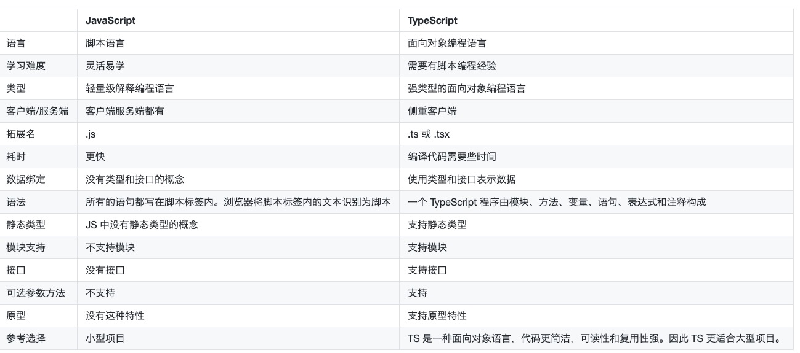

# typeScript


## 初见TypeScript

### why选择ts

- 可选的静态类型
- 面向对象语言


### Ts VS JS

```python
	# js的超集
	   tsc index.ts 可转化为 js
    
	# 新增
		class类
		interface接口
		generics泛型
		enums枚举
		
	# 强类型语言
		js运行时才暴露error
		ts开发时就能给出编译error
```



### helloWorld

hello.ts

```ts

console.log("hello world");

```

### 运行ts

方法1：转换为js，执行js

```ts
tsc hello.ts 
node hello.ts
```


方法2：ts-node直接运行

```
npm install -g typescript
npm install -d tslib @types/node
```


```shell
$ ts-node hello.ts                
hello world
```


## 基本数据类型


### 六大原始数据类型

####  布尔 boolean

#### 数字 number

#### 字符串 string

#### null 空值

#### undefined 未定义

#### Symbol （ES6 中的新类型）

```tsx
console.log("hello world")

var s: string = '2'

/**
 * 6大原始数据类型
 */
//  布尔 boolean
let isDone: boolean = false;

// 数字 number
let a: number = 6;
let b: number = 0b1010;
let c: number = 0o744;

// 字符串 string
let myName: string = "xiaming";
let myAge: number = 25;

// 模板字符串
let sentence: string = `Hello, my name is ${myName}。 I am ${
    myAge + 1
} years old next month`;

// 空值void
// ts中可以表示没有任何返回值的函数, js不存在
function alertName(): void{
    alert('My name is Tome')
}
// 声明void，只能表示undefined或null
let unde: void = undefined;
let nu: void = null;
// 把数字赋值给void类型的变量
// let num: void = 3;  // Error：不能将类型“3”分配给类型“void”。

//  null和undefined
let und: undefined = undefined;
let nul: null = null;
// 与void不同
// undefined 和 null 是所有类型的子类型,可以赋值给number
let num: number = undefined;
let un: undefined;
let num2: number = un;
```


与JavaScript的区别

```js
console.log("hello world");
var s = '2';

//  布尔 boolean
var isDone = false;

// 数字 number
var a = 6;
var b = 10;
var c = 484;

// 字符串 string
var myName = "xiaming";
var myAge = 25;
// 模板字符串
var sentence = "Hello, my name is " + myName + "\u3002 I am " + (myAge + 1) + " years old next month";

// 空值void
// ts中可以表示没有任何返回值的函数, js不存在
function alertName() {
    alert('My name is Tome');
}
// 声明void，只能表示undefined或null
var unde = undefined;
var nu = null;
// 把数字赋值给void类型的变量
// let num: void = 3;  // Error：不能将类型“3”分配给类型“void”。

//  null和undefined
var und = undefined;
var nul = null;
// 与void不同
// undefined 和 null 是所有类型的子类型,可以赋值给number
var num = undefined;
var un;
var num2 = un;

```


### 非原始数据类型

#### 1、Array数组

```ts
//  1、数组
// 定义数组的两种方式
// 方式1：普通方式  数组表现方式 类型[]
let arr: number[] = [1, 2, 3, 4];
// 方式2：泛型方式 Array<元素类型>。
let list: Array<number> = [1, 2, 3];
```


#### 2、Tuple 元祖

```ts
// 2、元组
// 表示一个已知元素数量和类型的数组，各元素的类型不必相同。
let x: [string, number]
x = ["hello", 10]
```


#### 3、enum 枚举

```ts
// 3、枚举
// 一组有区别的用例

// 之前
// 利用 const 关键词也可以声明一组常量，例如，声明十二生肖的排位
const rat: number = 1;
const cattle: number = 2;
const tiger: number = 3;
const rabbit: number = 4;
const dragon: number = 5;

// 现在
// 数字枚举
enum ChineseZodiac {
  rat,
  cattle,
  tiger,
  rabbit,
  dragon,
}

// 字符串枚举
enum Env{
    pre = "PRE",
    fat = "FAT",
    uat = "UAT",
    pro = "PRO",
    pt = "PT"
}
console.log(Env.pre); // PRE
console.log(Env.pro); // PRO
```


#### 4、never 永不存在的值的类型

```ts
// 4、never
// 任何类型的子类型，一般作为函数返回值
// 返回never的函数必须存在无法到达的终点
function error(message: string): never {
    throw new Error(message);
}
```


#### 5、void

```ts
// 5、void
// 与any类型相反，表示没有任何类型。一般一个函数没有返回值用void
function warn(): void{
    console.log("this is my warning message");
}
```


#### 6、any 任意类型

```ts
// 6、any
// 任意类型,声明1个变量为any后，对它的任何操作，返回内容类型都是任意值
// 变量声明未指定类型，默认为any
let notSure: any = 4;
notSure = "这是字符串";
notSure = false;
```


#### 7、联合类型

```ts
// 7、联合类型
// 取值可以为多种类型的一种
let num: string | number
num = 3
num = "three"
```


#### 8、object对象类型

```ts
// 8、object对象类型
declare function create(o: object | null): void;

create({name:0}) // ok
create(null) // ok
create(2) // Error
create(false) // Error
```


### 类型断言

类型断言可以用来手动指定一个值的类型，即允许变量从一种类型更改为另一种类型。

```ts
//  类型断言
// 允许变量从一种类型变为另一种类型

// 方式1
let someAny: any = "my name is tony"
let strLength: number = (<string>someAny).length;

// 方式2
let someAny: any = "my name is tom"
let strLength: number = (someAny as string).length


```


### 类型判断 typof

如何判断1个变量的类型呢？

```ts
if(typeof str === "string"){
        return true
    }
```


## 接口

​	interface是`为了定义一些数据类型`，比如map，json
​    只声明属性、方法，不实现
​    相当于一个特殊的class，，也没有constructor，没有方法的实现


### 接口定义

```ts
// 接口的定义
interface Persion{
    name: string;
    age: number;
}

let tom: Person = {
    name: "tom",
    aget: 18
}


```


### 可选属性

`age?: number;`   可以不填写

```ts
// 可选属性
//  在属性后使用 ? 表示这个属性是可选属性
//  可选属性可以不存在，单不允许添加未定义的属性
interface Persion{
    name: string;
    age?: number;
}

let jack: Persion = {
    name: "jack"
}


```


### 任意属性

`[propName: string]: any ` 该属性可以取任意类型

```ts
// 任意属性
interface Persion{
    name: string;
    age?: number;
    [propName: string]: any  // 定义了任意属性取 string 类型的值
}

let alex: Persion = {
    naem: "alex",
    gender: "male"
}
```


### 只读属性

`readonly id: number;` 该属性只能读，不能修改

```ts
// 只读属性
interface Person{
    readonly id: number;  // 某些字段只能创建的时候被赋值
    name: String;
    age: number;
    [propName: string]: any;
}

let read: Person = {
    id: 123,
    name: "read",
    age: 33,
    gender: "male",
}

read.age = 22
read.id = 33

```


## 类（class）


### 类的概念

**class类**：定义了一件事物的抽象特点，包含它的属性和方法

**Object对象**：类的实例，通过`new`生成

**面向对象的三大特征**： 封装、继承、多态

#### 1、封装

将数据的处理细节，隐藏起来，只对外暴露接口。不需要知道细节，相当于`黑盒测试`

#### 2、继承

子类继承父类，有子类的所有属性和方法，也可以自定义自己的

定义数据模型时，`HostModel继承BaseModel`，继承父类的基本属性字段，也有自己额外的字段

#### 3、多态

由继承而产生了相关的不同的类，对同一个方法有不同的相应

> 比如，HostModel、PodModel都继承BaseModel，此时BaseModel有printf方法，返回此时的表名，类型等。
>
> 可以怎么调用呢？
> 不需要分开调用 HostModel().printf() 或者PodModel().printf() ---->直接调用BaseModel().printf()
>
> `我们无需了解它是 HostModel 还是PodModel，就可以直接调用printf 方法，程序会自动判断应该如何执行 printf。`


### 类的定义

```ts

// class定义类
class Greeter{

    // 属性
    greeting: string;
    
    // constructor定义构造函数
    constructor(message: string){
        this.greeting = message;
    }

    // 方法
    greet(){
        alert("hello," + this.greeting);
    }

}

let greeter = new Greeter("world");
greeter.greet()

```


### 类的继承

```ts
/**
 * 类的继承
 * */  

// 父类
class Person{
    name: string;

    constructor(name: string){
        // 构造函数，实例化类的时候触发的方法
        this.name = name;
    }

    run():void{
        console.log(`${this.name} is running`);
        
    }
}

let p = new Person("父亲")
p.run();  // 父亲在运动

// 子类继承父类
class Child extends Person{
    constructor(name: string){
        super(name);  // 初始化父类的构造函数
    }
}

let s = new Child("儿子")
s.run();   // 儿子在运动
```


### 类里面的修饰符

修饰符是一些关键字，用于`限定成员或类型的性质`，public，protected，private

- public：公有，在当前类里面、子类、类外面都可以访问。（默认公有）

```ts
class Person{
    public name: string;  // 公有

    constructor(name: string){
        this.name = name;
    }

    run():void{
        console.log(`${this.name} is running`);  // 在类里能访问
        
    }
}

let p = new Person("父亲")
p.run();  
p.name;  // 在类外面能访问


class Child extends Person{
    constructor(name: string){
        super(name);  // 初始化父类的构造函数
    }

    run():void{
        console.log(`${this.name} is running ---》 子类`);  // // 子类能访问
    }
}

let s = new Child("儿子")
s.run();   // 儿子在运动
s.name  // 在类外面能访问
```


- protected：保护类型，在当前类里面、子类里面可以访问，在类外部没法访问。

```ts
class Person{
    protected name: string;  // 保护类型

    constructor(name: string){
        this.name = name;
    }

    run():void{
        console.log(`${this.name} is running`);  // 在类里能访问
        
    }
}

let p = new Person("父亲")
p.run();  
// console.log(p.name); // 报错，在类外面不能访问


class Child extends Person{
    constructor(name: string){
        super(name);  // 初始化父类的构造函数
    }

    run():void{
        console.log(`${this.name} is running ---》 子类`);  // // 子类能访问
    }
}

let s = new Child("儿子")
s.run();   // 儿子在运动
// console.log(c.name); // 报错，在类外面不能访问
```


- private：私有，在当前类里面可以访问，子类、类外部都没法访问。

```ts
class Person{
    private name: string;  // 保护类型

    constructor(name: string){
        this.name = name;
    }

    run():void{
        console.log(`${this.name} is running`);  // 在类里能访问
        
    }
}

let p = new Person("父亲")
p.run();  
// console.log(p.name); // 报错，在类外面不能访问


class Child extends Person{
    constructor(name: string){
        super(name);  // 初始化父类的构造函数
    }

    run():void{
  // console.log(`${this.name}在运动--子类`); // 报错，子类不能访问
    }
}

let s = new Child("儿子")
s.run();   // 儿子在运动
// console.log(c.name); // 报错，在类外面不能访问
```


### 静态属性和方法

TS静态属性，静态方法。为了不让`用户修改`，内置的

定义时，用`static修饰`
调用时，直接用`类来调用`

```ts
// TS 静态方法 静态属性
// 用static修饰
class Human{

    public name: string;
    public age: number = 20;
    
    // 静态属性
    static sex = "男" 
    
    constructor(name: string){
        this.name = name
    }

    run(){
        console.log(`${this.name}在运动`)
    }
    work(){
        console.log(`${this.name}在工作`)
    }
  
    // 静态方法，没法直接调用类的属性
    static print(){
        console.log("print 静态方法" + Human.sex)  
    }
}

var p = new Human('tony');
p.work();
p.run();

//直接通过类来调用
Human.sex; // 男
Human.print();
```


ES 静态方法、静态属性

```js
// ES 静态方法、静态属性
function Person(){
    this.run1 = function(){}  // 实例方法，实例化后调用
}

Person.run2 = function(){}  // 静态方法，类名直接调用

Person.name = "luffy"  // 静态属性
Person.run2()  // 静态方法的调用
```


### abstract抽象类，抽象方法

不能直接实例化的类，必须通过`子类继承来实例化`

> 比如定义数据模型时，需要BaseModel来提供其他表的扩展字段，不生成表

```ts
// 抽象类
abstract class BaseModel {
    public createdTime: string
    public updatedTime: string
    public isDeleted: boolean

    public constructor(createdTime: string, updatedTime: string, isDeleted: boolean){
        this.createdTime = createdTime
        this.updatedTime = updatedTime
        this.isDeleted = isDeleted

    }
   
    // 抽象方法
    public abstract sayHi()
}

// 无法创建抽象类的实例。
// let a = new BaseFields("2021年07月14日17:19:40"， "2021年07月14日17:19:47"， 1)
```


此时定义新的BookModel，只需要继承BaseModel即可

```ts
// 抽象类必须被子类继承实现
class Book extends BaseModel{
    public sayHi(){
        console.log(`${this.createdTime} is starting`)
    }
}

let book = new Book("2021年07月14日17:26:08", "2021-07-14 17:26:13", true)

book.sayHi()
```


## 函数

函数为了实现抽象层，模拟类，信息隐藏，模块。为了`代码的复用，解耦`

### 定义

TS中函数的定义如下，传入的值，返回的值，都`需要声明类型`

```ts
// 传参
function fn3(name, age) {
  console.log(`姓名：${name}，年龄：${age}`);
}
fn3('张三', 18);

function fun1(): number{
    return 123
}

fun1()

// 匿名函数
let fun2 = function():void{
    console.log("345")
}

fun2()

// 传参数
function fun3(name: string, age: number): void{
    console.log(name, age)
}

fun3("alex", 23)
```

ES函数定义如下

```js
// 函数声明
function func1(){
    console.log("123")
}

func1()  

// 匿名函数  只使用一次的函数
let func2 = function(){
    console.log(345)
}

func2()


// 传参
function fn3(name, age) {
  console.log(`姓名：${name}，年龄：${age}`);
}
fn3('张三', 18);
```


### 参数

（1）可选参数

TS中，形参与实参个数必须一一对应，ES可以不同
为了不对应起来，可以用可选参数 `age?: age`

```ts
// 可选参数
// TS中的形参和实参，必须一一对应，ES可以不一致
// 如果想动态的匹配，可以用可选参数，必须在参数的最后

function getInfo(name: string, age?: number): string{

    if(!age){
        return `姓名：${name}`
    }
    return `姓名：${name}, 年龄 ${age}`
}

let g = getInfo("alex")
let g = getInfo("jack", 33)
```


(2) 默认参数

默认参数，可以不传参，使用`age: number = 20`

```ts

// 默认参数
function getInfo(name: string, age: number = 20): string{
    // age 默认为20
    if(!age){
        return `姓名：${name}`
    }
    return `姓名：${name}, 年龄 ${age}`
}

let g = getInfo("alex")
let g = getInfo("jack", 33)
```


(3) 剩余参数

用`...rest的方式`获取函数中的剩余参数

```ts
// ..rest 的方式获取函数中的剩余参数
function push(array, ...items){
    items.forEach(function (item){
        array.push(item)
    })
}


// 事实上，items是一个数组
function push2(array: any[], ...items: any[]){
    items.forEach(function (item){
        array.push(item)
    })
}

let a = []
push(a, 1,2,3)
alert(a)
```


### 用接口定义函数的形状

用接口的方式，定义1个函数需要符合的样式

```ts

interface Fn{
    (x: number, y: number): boolean;
    // 左边表示函数的输入类型，右边表示输出类型
}

let fn: Fn
fn = function (x: number, y: number){
    return x > y
}

fn(3,4)
```


js的写法

```js
var fn;
fn = function(x,y){
    return x>y
}
```


### 函数重载

JS中，方法的重载：指的是两个or`两个以上的同名函数`，但它们的`参数不同`，后面的会替换前面的方法

TS中的重载指的是：为`同一个函数`提供`多个函数类型定义`来实现多种功能的目的

#### （1）单个参数，不同类型

```ts

// 1、单个参数，不同类型
function getHostInfo(ip: string): string;

function getHostInfo(mask: number): string;

function getHostInfo(str: any): any{
    if(typeof str === "string"){
        return `ip ${str}`
    }else{
        return `mask ${str}`
    }
}


getHostInfo("1.1.1.1")
getHostInfo(24)

// getHostInfo(true)  // 错误的写法
```


#### （2） 多个参数，可选参数

```ts
// 2、多个参数，可选参数
function getInfo(name: string): string
function getInfo(name: string, age: number): string
function getInfo(name: string, age?: number): string{
    return `name: ${name}, age: ${age}`
}

getInfo("alex")
getInfo("alex", 33)
// getInfo(33)   // 错误的写法
```


JS

```js
function getInfo(name) {}
function getInfo(name, age) {}
```


## 模块

time模块，对外提供一个完整的功能，`解决代码的复用`

### 模块的导入导出

模块是自动声明的。

import 是导入模块，
export是声明1个模块，可以是class，function，其他变量

定义1个模块

```ts
export class Animal{
    name: string;

    constructor(name: string){
        this.name = name
    }

    show(): string{
        return this.name
    }
}
```

使用模块

```ts
import { Animal } from "./moduleA";

let dog = new Animal("jack");

dog.name = "jack"
let res = dog.show()
console.log(res);
```


### 导入和导出的重命名

定义模块person，并重命名为PERSON

```ts
// 模块定义2
class Person{
    name: string

    constructor(name: string){
        this.name = name
    }

    showInfo(): string{
        return this.name
    }
}

export {Person as PERSON}
```

使用模块

```ts
// 使用模块2
import { PERSON as person } from "./moduleA";

let man = new person("tom")
man.name = "alex"
let info = man.showInfo()
console.log(info);

```

### * 导入模块(不推荐)

定义多个模块

```ts
// 定义多个模块or类型对象

enum CMDBURL{
    FAT = "fat-cmdb2-api",
    PRE = "pre-cmdb2-api",
    PRO = "pro-cmdb2-api",
}

class Host{
    ip: string;
    port: number;
    cmdb: CMDBURL

    constructor(ip: string = '1.1.1.1', port: number=3306){
        this.ip = ip
        this.port = port
        this.cmdb = CMDBURL.PRO
    }

    show(): string{
        return this.ip + this.port + this.cmdb
    }
}

export{CMDBURL,Host}
```

使用*导入多个模块

```ts
// * 不知道模块的名称, 用 * 号代替
import * as allMoudle from "./moduleA"


// 导入多个模块和对象
import * as host_module from "./moduleA"

let master = new host_module.Host()
master.ip = "192.168.23.22"
master.cmdb = allMoudle.CMDBURL.PRO
master.show()

console.log(master.ip +  master.cmdb);
```

 

### 默认导出

default默认导出，只有1个模块

```ts
// 默认导出只有一个
enum Duck{
    name = "duck",
    age = 22
}
export default Duck
```

使用模块

```ts
// 使用默认导入
import Duck from "./moduleA";

console.log(Duck.name);
```


## 命名空间

### 命名空间的基本使用

`为了解决重名问题`。村里有个姑娘叫小芳，2个。如何区分呢？

1个标识符，函数，interface，class可以在多个命名空间内定义，不会冲突


定义命名空间

```ts
export namespace A{
    export class People{}
    export interface Human{}
    export const height: number = 180
    export function main(): void {
    }
}
```

使用命名空间

```ts
import { A } from "./namespaceA";

console.log(A.People);

```


### 嵌套命名空间

可以在另一个命名空间中定义一个命名空间

```ts
//  嵌套命名空间
namespace namespace_out{
    export namespace namespace_inner{
        export interface host{}
        export class Host{
            public getHostPrice(price: number): number{
                return price + 10
            }
        }
    }
}

```

用. 进行命名空间的调用

```ts
//  用点（.）运算符访问嵌套命名空间的成员
let add = new namespace_out.namespace_inner.Host()

let res = add.getHostPrice(30)
console.log(res);
```


### 命名空间与模块

```ts
 * 命名空间 vs 模块
 * 
 * 模块：1个完整功能的封装，对外提供。比如time模块
 *      1个模块可能包含多个命名空间
 * 
 * 命名空间：为了区分两个小明同学
 *        具有相似功能的代码，放到同一个空间进行管理，方便其他代码引用
 *         侧重于代码的复用
 *        
```

